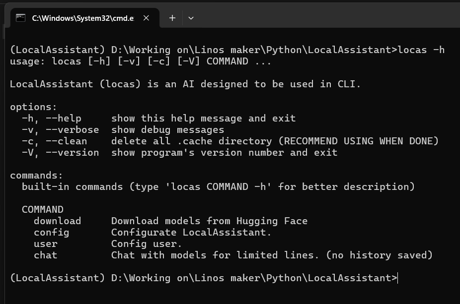

<div align="center">

# LocalAssistant

**Locas - your local assistant**

[![][latest-release-shield]][latest-release-url]
[![][latest-commit-shield]][latest-commit-url]
[![][pypi-shield]][pypi-url]
[![][python-shield]][python-url]

[latest-release-shield]: https://badgen.net/github/release/Linos1391/LocalAssistant/development?icon=github
[latest-release-url]: https://github.com/Linos1391/LocalAssistant/releases/latest
[latest-commit-shield]: https://badgen.net/github/last-commit/Linos1391/LocalAssistant/main?icon=github
[latest-commit-url]: https://github.com/Linos1391/LocalAssistant/commits/main
[pypi-shield]: https://img.shields.io/badge/pypi-LocalAssistant-blue
[pypi-url]: https://pypi.org/project/LocalAssistant/
[python-shield]: https://img.shields.io/badge/python-3.10+-yellow
[python-url]: https://www.python.org/downloads/



This AI is designed to be used in CLI.

</div>

# Download by Pypi

Visit [Pypi](https://pypi.org/project/LocalAssistant) and follow the instuctrion.

<br>

# Download by GitHub:

## Table of contents

1. [Installing](#installing)

2. [Preparing](#preparing)

3. [Running](#running)

4. [License](#license)

5. [Disclaimer](#disclaimer)

<br>

## Installing

1. Clone the repository.

```
git clone https://github.com/Linos1391/LocalAssistant.git
cd LocalAssistant
```

2. Visit [PyTorch](https://pytorch.org/get-started/locally/) and download the version for your device.

```
# Example: (Me using WINDOW with CUDA 12.4)

pip3 install torch torchvision torchaudio --index-url https://download.pytorch.org/whl/cu124
```

3. Install the required python packages.

```
pip install -r requirements.txt
```

<br>

## Preparing 

<details>
  <summary><h3>Unix</h3></summary>

  Go to your `LocalAssistant` directory (Where `requirements.txt` is stored). 

  ```
  cd ...
  ```

  Then thing goes:

  ```
  chmod a+x locas.cmd
  echo 'export LocalAssistant=$PWD
  export PATH=$LocalAssistant:$PATH' >> ~/.bash_profile
  source ~/.bash_profile
  ```

  <br>

  Before doing anything, we should download a model first.

  ```
  locas.cmd download -n Qwen Qwen/Qwen2.5-1.5B-Instruct 3
  ```

  **Notice:** Due to using .cmd, Unix user have to type 'locas.cmd' instead of 'locas'.

</details>

<details>
  <summary><h3>Window</h3></summary>
  
  Open your Powershell. Go to your `LocalAssistant` directory (Where `requirements.txt` is stored). 
    
  ```
  cd ...
  ```
    
  Then thing goes:

  ```
  $new_entry = $PWD

  $old_path = [Environment]::GetEnvironmentVariable('path', 'user');
  $new_path = $old_path + ';' + $new_entry
  [Environment]::SetEnvironmentVariable('path', $new_path,'User');
  ```

  Then close your Powershell.

  <br>

  Before doing anything, we should download a model first.

  ```
  locas download -n Qwen Qwen/Qwen2.5-1.5B-Instruct 3
  ```
  
</details>

<br>

## Running

#### If you're using Anaconde or Docker, modify [locas.cmd](locas.cmd) file.

<details>
  <summary><h3>Unix</h3></summary>
  
  **Notice:** Due to using .cmd, Unix user have to type 'locas.cmd' instead of 'locas'.

  ```
  locas.cmd ...
  ```

  Use `locas.cmd -h` for more.
    
</details>

<details>
  <summary><h3>Window</h3></summary>
  
  ```
  locas ...
  ```

  Use `locas -h` for more.
  
</details>

<br>

## License

[GNU GPLv3](LICENSE)

<br>

## Disclaimer

This AI was designed to communicating with Hugging Face models in CLI. Please do not use this AI for any unethical reasons. Any damages from abusing this application will not be the responsibility of the author.
