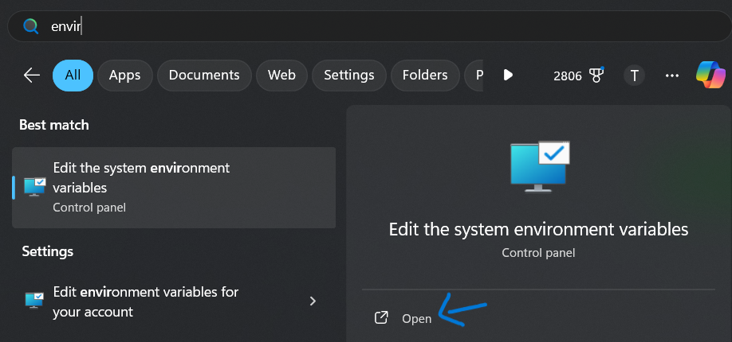
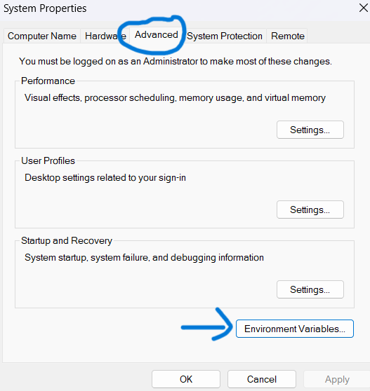
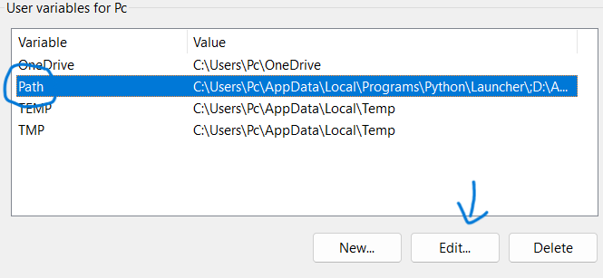
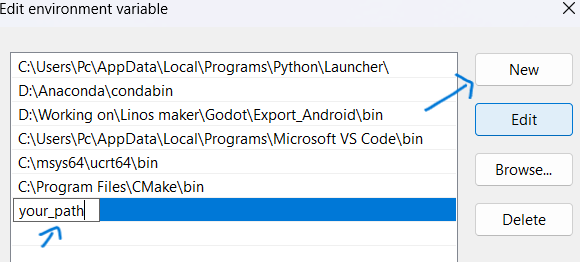
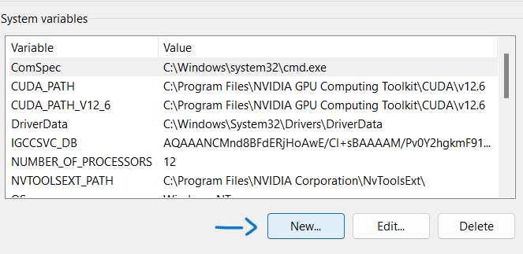
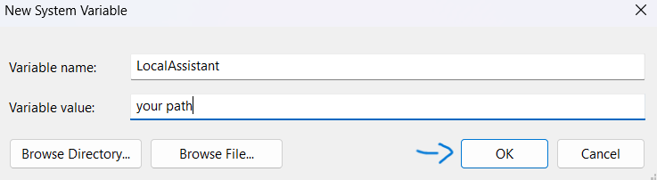

<div align="center">

# LocalAssistant

**Locas - your local assistant**

[![][locas-shield]][locas-url]
[![][python-shield]][python-url]
[![][conda-shield]][conda-url]
[![][transformers-shield]][transformers-url]

[locas-shield]: https://img.shields.io/badge/LocalAssisitant-0.1.dev2-red
[locas-url]: https://github.com/Linos1391/LocalAssistant
[python-shield]: https://img.shields.io/badge/Python-3.12+-yellow
[python-url]: https://www.python.org/downloads/
[conda-shield]: https://img.shields.io/badge/Anaconda-24.7+-grass
[conda-url]: https://www.anaconda.com/download
[transformers-shield]: https://img.shields.io/badge/Transformers-4.46+-orange
[transformers-url]: https://huggingface.co/docs/transformers/v4.46.0/index


This AI is designed to be used in CLI.

</div>

# Download by Pypi

Visit [Pypi](https://pypi.org/project/LocalAssistant) and follow the instuctrion.

<br>

# Download by source:

## Table of contents

1. [Installing](#installing)

2. [Preparing](#preparing)

3. [Running](#running)

4. [License](#license)

5. [Disclaimer](#disclaimer)

<br>

## Installing

1. Clone the repository.

```
git clone https://github.com/Linos1391/LocalAssistant.git
cd LocalAssistant
```

2. Visit [PyTorch](https://pytorch.org/) and download the version for your device.

3. Install the required python packages.

```
pip install -r requirements.txt
```

<br>

## Preparing 

### [UNIX](#unix) | [Window](#window)

### Unix

We are inside `./LocalAssistant/` directory.

```
echo $PWD
```

The path is your path to locas.cmd file (called as `<your_path>`). Remember to left it somewhere so you will not forget.

<br>

Change permission so we can access later:

```
chmod a+x locas.cmd
```

<br>

Next, we have to add this path to envirment variable. (with 3 steps)

1. Edit the .bash_profile file.

```
nano ~/.bash_profile
```

2. At the end of the file, export the path. (Don't forget the `"`)

```
export LocalAssistant="<your_path>"
export PATH=$PATH:$LocalAssistant
```

3. After done, save the changed.

```
source ~/.bash_profile
```

<br>

Before doing anything, we should download a model first.

```
locas.cmd download -n Qwen Qwen/Qwen2.5-1.5B-Instruct 3
```

**Notice:** Due to using .cmd, Unix user have to type 'locas.cmd' instead of 'locas'.

### Window

We are inside `./LocalAssistant/` directory.

```
echo %cd%
```

Copy the path below as its your path to locas.cmd file. Remember to left it somewhere so you will not forget.

<br>

Next, we have to add this path to envirment variable. (with 4 steps)

1. Press `Win` and search for `environment` until `edit the system environment variables` shown up. Open it.



2. Click the `Environment Variables` button.



3. Press on `Path` and click `Edit` button. 



4. Click `New` and paste your path in.



Then press `OK`.

5. On `System viables` tab, click `New` button.



6. Type `LocalAssistant` on `Variable name`, then paste the path on `Variable value`



Then press `OK`.

**Notice:** When done, click `OK` until out. Otherwise the path might not saved. Try have a look again for sure.

<br>

Before doing anything, we should download a model first.

```
locas download -n Qwen Qwen/Qwen2.5-1.5B-Instruct 3
```

<br>

## Running

#### If you're using Anaconde or Docker, modify [locas.cmd](locas.cmd) file.

### Unix

**Notice:** Due to using .cmd, Unix user have to type 'locas.cmd' instead of 'locas'.

```
locas.cmd ...
```

Use `locas.cmd -h` for more.

### Window

```
locas ...
```

Use `locas -h` for more.

<br>

## License

[GNU GPLv3](LICENSE)

<br>

## Disclaimer

This AI was designed to communicating with Hugging Face models in CLI. Please do not use this AI for any unethical reasons. Any damages from abusing this application will not be the responsibility of the author.
